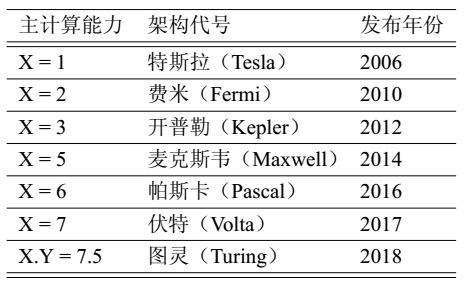
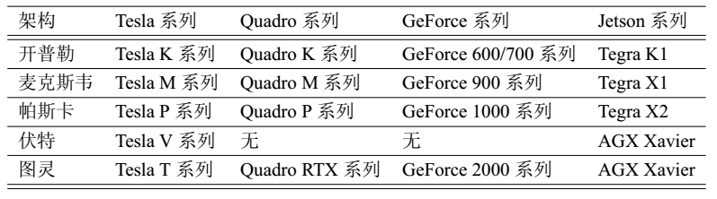
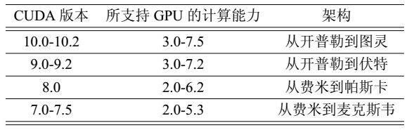
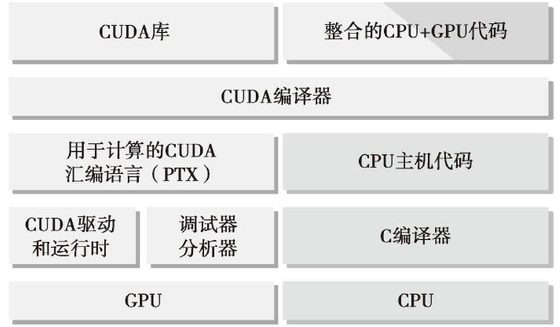
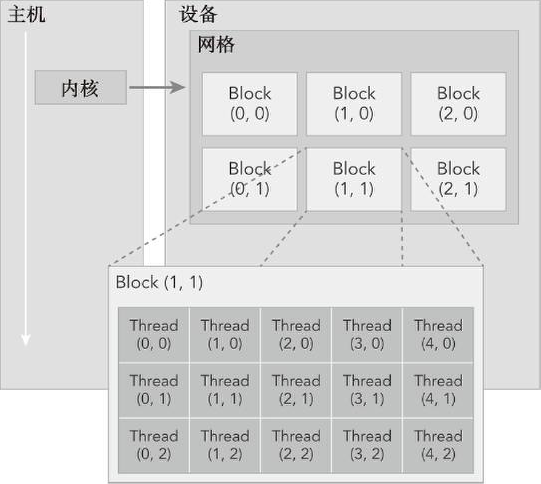
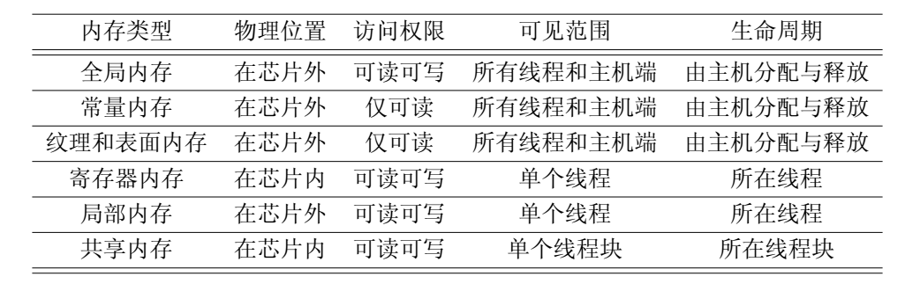

## CUDA Learning Record

随着显卡的发展,GPU越来越强大,在计算上已经超过了通用的CPU.为了更大限度的利用GPU的运算能力,NVIDIA推出CUDA, 使得显卡可以用与图像计算之外的目的.

### CPU+GPU异构并行计算架构

GPU计算不是指单独的GPU计算，而是指CPU+GPU的异构计算。

NVIDIA各个GPU主计算能力的架构代号  


目前常用的各种GPU  


CUDA版本与所支持的GPU算力  


CPU与GPU是两个独立的处理器，之间通过PCIe总线相连。GPU不是一个独立的运行平台，而是CPU的一个协处理器。CPU所在位置称为主机端(host)，GPU所在位置称为设备端(device)

1. 评价GPU的指标
描述GPU容量的两个重要特征：

* CUDA核心数量
* 内存大小

相应的，评价GPU性能的两种指标：

* 峰值计算性能
* 显存带宽

峰值计算性能用来评估计算容量，通常定义为每秒能够处理的单精度或双精度浮点运算的数量。单位通常为GFlops(每秒十亿次运算)或TFlops(每秒万亿次运算)。   
显存带宽是从内存中读取或写入数据的比率。单位通常为GB/s。

2. CPU与GPU的线程与核心

CPU的线程通常是重量级的实体，操作系统必须交替线程，启用或关闭CPU执行通道，以提供多线程处理功能，上下文切换缓慢且开销大。

GPU的线程是高度轻量级的，在一个典型的系统中会有成千上万的线程排队等待工作。

CPU的核心被设计为尽可能减少一个或两个线程运行时间的延迟

GPU的核心是用来处理大量并发的、轻量级的线程，以最大限度地提高吞吐量

3. CPU+GPU异构

CPU具有处理复杂逻辑和指令级并行的能力   

GPU中有大量可编程核心，可支持大规模多线程运算，且相比CPU有更大的峰值带宽。   

CPU+GPU的异构并行计算架构利用CPU和GPU的功能互补性，使得程序能够获得最佳的运行效果。
在CPU上执行串行部分或任务并行部分，在GPU上执行数据密集型并行部分。


### CUDA编程模型

程序中用host指代CPU及其内存, 用device指代GPU及其内存.CUDA程序中既包含host程序又包含device程序,他们分别在CPU和GPU上运行. 同时,host与device之间可以进行通信.

1. nvcc的编译过程



CUDA的编译器驱动nvcc先将全部源代码分离为主机(host)代码和设备(device)代码。主机代码完全支持C++语法，而设备代码只是部分支持。

nvcc先将设备代码编译为PTX(Parallel Thread eXecution)伪汇编代码，再将PTX代码编译为二进制的cubin目标代码

2. nvcc编译选项

* 在将源代码编译为PTX代码时，需要用选项``-arch=copute_XY``指定一个虚拟架构的计算能力，以确定代码中能够使用的CUDA功能。

* 在将PTX代码编译为cubin代码时，需要用选项``-code=sm_ZW``指定一个真实架构的计算能力，以确定可执行文件能使用的GPU。指定了GPU的真实架构为Z.W,对应的可执行文件只能在主版本号为Z、次版本号大于等于W的GPU中运行。

* 真实架构的计算能力必须大于虚拟架构的计算能力

* 使得编译出来的可执行文件在更多的GPU中执行，可以同时指定多组计算能力，每一组用如下形式的编译选项：   
``gencode arch=compute_XY,code=sm_ZW``

* 即时编译：在运行可执行文件时，从其中保留的PTX代码中临时编译出一个cubin目标代码，编译时保留这样的PTX代码需要用如下编译选项指定虚拟架构：   
``-gencode arch=compute_XY,code=compute_XY``

* ``arch=sm_XY``等价于
```
-gencode arch=compute_XY,code=sm_XY
-gencode arch=compute_XY,code=compute_XY
```

3. CUDA程序的基本框架

```c
头文件包含
宏定义
用户函数和CUDA核函数的声明
int main(){
    分配主机与设备内存
    初始化主机中的数据
    将某些数据从主机复制到设备
    调用核函数在设备中进行计算
    将某些数据从设备复制到机
    释放主机与设备内存
}
```

### CUDA C++语法

* 核函数中的线程常组织为若干个线程块(thread block)，每个线程块中有若干个线程(thread)。
* 核函数中的全部线程块构成一个网格(grid)，线程块的个数记为网格大小(grid size)，每个线程块中有同样数目的线程，该数目称为线程块大小(block size)。


1. \_\_global\_\_

__global__是CUDA C/C++的函数修饰符, 表示该函数为一个kernel函数, 该函数在CPU上调用，且:
* 该函数会在GPU(device)上执行
* 必须返回void
* 由主机(host)代码调用:
``fun_name<<<grid_size, block_size>>>()``
* 在调用kernel函数时,函数名后的<<<grid_size, block_size>>>
    * gird_size表示网格大小
    * block_size表示线程块大小

2. 线程索引
在核函数内部，程序将配置参数gird_size和block_size这两个参数值分别保存于如下两个内建变量(built-in variable)中：
* gridDim.x: 数值于grid_size相等
* blockDim.x: 数值与block_size相等
类似地，在核函数中预定义了如下表示线程的内建变量：
* blockIdx.x: 指定一个线程在网格中的线程块指标，取值范围是从0到gridDim.x-1。
* threadIdx.x: 指定一个线程在线程块中的线程指标，取值范围是从0到blockDim.x-1。

3. 多维网格
* unit3：
    blockIdx和threadIdx是类型为unit3的结构体变量，该结构体共有三个成员变量x，y，z。
* gridDim：
    gridDim和blockDim是类型为dim3的结构体变量，该结构体共有三个成员变量x，y，z。
这些内建变量均只在核函数中有效(可见)。在调用核函数时的执行配置中：  

``<<<grid_size, block_size>>>``  

grid_size和block_size的值被分别赋给内建变量gridDim.x和blockDim.x，此时，girdDim和blockDim中没有被指定的成员y和z取默认值1。在这种情况下，网格和线程块均为“一维”的。

* 构造多维网格和线程块：
因为gird_size和block_size均为dim3结构体类型，所以可以通过结构体dim3来定义多维的网格和线程块(用到了C++中构造函数的语法)：
```c
dim3 grid_size(Gx ,Gy, Gz);
dim3 block_size(Bx, By, Bz);
```
表示一维时，y和z可省略
表示二维时，z可省略

多维线程块本质上还是一维的，与多维线程指标threadId.x, threadIdy, threadId.z对应的一维线程指标为：  

``tid = threadId.x * blockDim.x + threadId.y * blockDim.y + threadId.z * blockDim.z;``

与多维线程块指标blockIdx.x, blockIdx.y, blockIdx.z相关联的线程块指标为：

``bid = blockIdx.z * girdDim.x * gridDim.y + blockIdx.y * gridDim.x + blockIdx.x;``

* 网格与线程块大小的限制

网格大小(grid_size)在x、y、z三个方向的最大允许值分别为2^31-1、65535、65535

线程块大小(block_size)在x、y、z三个方向的最大允许值分别为1024、1024、64。且blockDim.x、 blockDim.y、blockDim.z的乘积不能大于1024，即无论如何分配，一个线程块最多只能有1024个线程。

* 通常，一个网格会被组织成线程块的二维形式，一个线程块会被组织成线程的三维形式。

4. 函数执行空间标识符

* 用__global__修饰的函数叫做核函数，一般由主机调用，在设备执行。如果使用动态并行，则也可以在核函数中调用自己或其它核函数
* 用__device__修饰的函数叫做设备函数，只能被核函数或其它设备函数调用，并在设备中执行。
* 用__host__修饰的函数就是普通的C函数，在主机调用和执行。可以用__host__和__device__同时修饰一个函数，使得该函数既是一个主机函数，又是一个设备函数，以减少冗余代码。
* 不能同时用__device__和__global__修饰一个函数，即一个函数不能同时为设备函数和核函数
* 不能同时用__host__和__global__修饰一个函数，即一个函数不能同时为主机函数和核函数。
* 编译器把设备函数当做内联函数或非内联函数，可用修饰符__noinline__建议一个设备函数为非内联函数，也可以用修饰符__forceinline__建议一个设备函数为内联函数。

5. 设备内存的分类



**全局内存**

全局内存的含义是核函数中的所有线程都能够访问其中的数据。主要作用是为核函数提供数据，并在主机与设备以及设备与设备之间传输数据。   
全局内存的生命周期不是由核函数决定的，而是由主机端决定的

**静态全局内存变量**

静态全局内存变量所占的内存数量是在编译期间就确定的，且必须在说有主机与设备函数外部定义。   
对应的变量从其定义之处开始、一个翻译单元内的所有设备函数直接可见。

静态全局内存变量的定义：
```c
__device__ T x = 0; //单个变量
__device__ T y[N];  //固定长度的数组
```
T为变量类型。   

一般来说不建议使用静态全局内存变量

**常量内存**

常量内存是具有缓存的全局内存，一共仅有64KB，仅可读不可写。

在核函数外用__constant__定义常量内存，并用CUDA运行时API函数cudaMemcpyToSymbol将数据从主机端复制到设备的常量内存后供核函数使用。核函数对常量内存的访问要比对全局内存的访问要快。

计算能力大于等于2.0时，通过传值方式传给核函数的参数存放在常量内存中，该参数的内存在大于4KB，小于64KB时必须在定义时用__constant__修饰

**纹理内存和表面内存**

纹理内存和表面内存类似于常量内存，也是一种具有缓存的全局内存，而且一般仅可读(表面内存也可写)。但是纹理内存和表面内存的容量更大，且使用方式与常量内存不同。

对于算力大于等于3.5的GPU而言，将某些只读全局内存变量用**__ldg()**函数通过只读数据缓存读取，可以达到到使用纹理内存的加速效果。

``T __ldg(const T *address)``

**寄存器**

核函数中定义的不加任何限定符的变量一般来说存放在寄存器(register)中，但也可能存放于局部内存。

各种内建变量以及线程束大小(warpSize)都保存在特殊的寄存器中

寄存器变量仅仅被一个线程可见。

**局部内存**

寄存器中放不下的变量，以及索引值不能在编译时就确定的数组，有可能放在局部内存，由编译器自动决定。

**共享内存**

共享内存存在于芯片上，具有仅次于寄存器的读写速度。但它对于整个线程块可见，生命周期也与整个线程块一致。

共享内存的作用是减少对全局内存的访问。


6. 检测运行时错误

* CHECK函数
在头文件文件error.cuh中编写宏函数CHECK，输出捕获的运行时错误。   
函数头为：
```c
#define CHECK(call) \
...                 \
...
```
其中call为一个CUDA运行时API函数，调用时将一个CUDA运行时API函数作为参数传进该函数即可检验此运行时API函数在运行时发生的错误，并输出错误信息。

* 检查核函数
捕捉调用核函数时可能发生的错误，需要在调用核函数之后加上如下两句：
```c
CHECK(cudaGetLastError());
CHECK(cudaDeviceSynchronize());
```

7. CUDA-MEMCHECK检查内存错误
CUDA-MEMCHECK工具集包括memcheck、rececheck、initcheck、synccheck四个工具。他们可由可执行文件cuda-memcheck调用：
```bash
cuda-memcheck --tool memcheck [options] app_name [options]
cuda-memcheck --tool racecheck [options] app_name [options]
cuda-memcheck --tool initcheck [options] app_name [options]
cuda-memcheck --tool synccheck [options] app_name [options]
```

8. 用CUDA事件计时
```c
cudaEvent_t start, stop;
cudaEventCreate(&start); //创建事件类型变量
cudaEventCreate(&stop);
cudaEventRecord(start); //记录事件的开始
cudaEventQuery(start);  //查询Record是否完成事件的捕获

operate_fun(...);

cudaEventRecord(stop);  //记录事件的结束
cudaEventSynchronize(stop); //等待记录完成
float elapsed_time;
cudaEventElapsedTime(&elapsed_time, start, stop);
printf("Time = %f ms.\n", elapsed_time);
cudaEventDestory(start);
cudaEventDestory(stop);
```
创建事件 -> 记录事件的开始 -> 计时部分代码执行 -> 记录事件的结束 -> 计算耗时

**GPU计算核心**和**设备内存**之间的数据传输的传输峰值理论带宽要远大于**CPU**与**GPU**之间数据传输的理论峰值带宽，所以，想要获得可观的加速，就必须减少在数据传输上所花的时间，避免过多的数据经过PCIe传递。

9. 算数强度

一个计算问题的算数强度指的是其中**算数操作**的工作量与**必要的内存操作**的工作量之比

10. 一个CUDA程序获得高性能的必要条件：
* 数据传输比重小
* 核函数的算数强度较高
* 核函数中定义的线程数目较多

所以，在优化CUDA程序时尽量做到：
* 减少主机与设备之间的数据传输
* 提高核函数的算数强度
* 增大核函数的并行规模

### 函数

1. cudaDeviceRest()

用来显式地释放和清空当前进程中与当前设备有关的所有资源。

2. cudaMalloc

```c
cudaError_t cudaMalloc(void** devPtr, size_t size);
```

同C语言中malloc函数，为变量分配空间。第一个参数为内存分配的对象，第二个是分配的内存空间的**字节**大小。

3. cudaMemcpy

```c
cudaError_t cudaMemcpy(void* dst, const void* src, size_t count, cudaMemcpuKind kind);
```

从src指向的内存空间复制一定字节的数据到dst所指内存中，复制方向由kind指定，kind共有以下几种：
```
cudaMemcpyHostToHost
cudaMemcpyHostToDevice
cudaMemcpyDeviceToHost
cudaMemcpyDeviceToDevice
```

该函数以同步方式执行，在函数返回以及传输操作完成之前主机的应用程序是阻塞的。

4. cudaGetErrorString

cudaError_t为枚举类型，此类型变量有两个值：  **cudaSuccess**与**cudaErrorMemoryAllocaion**  

将错误代码转为可读字符串

```c
char* cudaGetErrorString(cudaError_t error);
```

5. cudaEventElapsedTime

计算事件之间经过(Elapse)的时间
```c
__host__ cudaError_t cudaEventElapsedTime(
    float* ms,        //返回事件执行的时间
    cudaEvent_t start, //事件的开始
    cudaEvent_t end    //事件的结束
);
```
