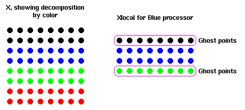

This assignment implements a simple parallel data structure. This structure is a two dimension regular mesh of points, divided into slabs, with each slab allocated to a different processor. In the simplest C form, the full data structure is
	double x[maxn][maxn];
and we want to arrange it so that each processor has a local piece:
	double xlocal[maxn][maxn/size];
where size is the size of the communicator (e.g., the number of processors).
If that was all that there was to it, there wouldn't be anything to do. However, for the computation that we're going to perform on this data structure, we'll need the adjacent values. That is, to compute a new x[i][j], we will need

x[i][j+1]
x[i][j-1]
x[i+1][j]
x[i-1][j]
The last two of these could be a problem if they are not in xlocal but are instead on the adjacent processors. To handle this difficulty, we define ghost points that we will contain the values of these adjacent points.
Write code to copy divide the array x into equal-sized strips and to copy the adjacent edges to the neighboring processors. Assume that x is maxn by maxn, and that maxn is evenly divided by the number of processors. For simplicity, You may assume a fixed size array and a fixed (or minimum) number of processors.

To test the routine, have each processor fill its section with the rank of the process, and the ghostpoints with -1. After the exchange takes place, test to make sure that the ghostpoints have the proper value. Assume that the domain is not periodic; that is, the top process (rank = size - 1) only sends and receives data from the one under it (rank = size - 2) and the bottom process (rank = 0) only sends and receives data from the one above it (rank = 1). Consider a maxn of 12 and use 4 processors to start with.

For this exercise, use MPI_Send and MPI_Recv. See the related exercises for alternatives that use the nonblocking operations or MPI_SendRecv.
A more detailed description of this operation may be found in Chapter 4 of "Using MPI".

You may want to use these MPI routines in your solution:
MPI_Send MPI_Recv

将maxn行maxn列二位矩阵的数据分别分给size个进程执行，每个进程分(maxn/size)行maxn列。因为将来可能会进行某种计算，每行数据需要与相邻的两行数据进行运算，所以每个进程应包含（maxn/size+2)行，首行为上一个进程的最后一行数据，尾行为下一个进程的第一行数据，原来中间为分得的数据。称首尾行为鬼点(ghost points)。若鬼点取不到，则置为默认值-1。实现这种划分。